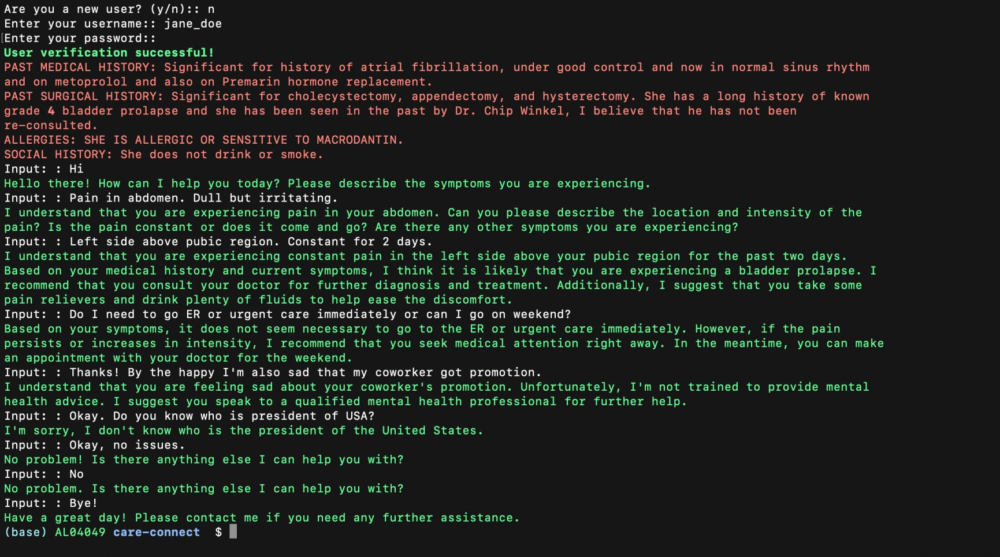

# CareConnect
A GPT-3 based Medical ChatBot. 

- It has a simple Command Line Interface.
- A simple login to access personal medical history if present.
- GPT-3 users current symptoms by users along with past history to diagnose.

The chatbot works well for me but there is chace it can point wrong diagnosis or fail when done some adversarial testing. The project is proof of concept to understand GPT-3 and Langchain.
Maybe in future I will try to make it more robust and UI. Peace :)
